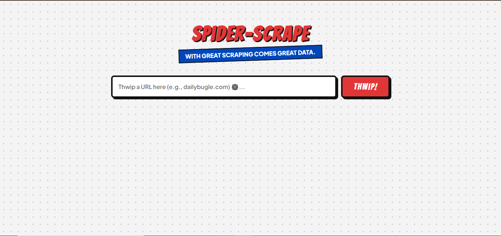
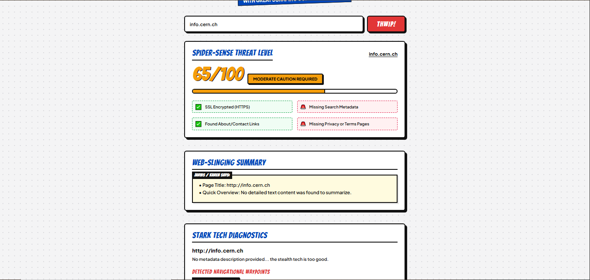

# *Spider Scrapes*

> A cool name right?

This is a web that uses some basic js script to find some great info,
what I mean is that this can find headings of the websites and give it
a rating according to its details like if it has meta tags, or what is its title what are some contents etc

this web can be accessed from
https://web-scrapppy.onrender.com

I have added some cool ui and
if I say that what best in my code then it's the ui 

I spent a lot of time making this, check out the code in `index.html` for ui and `script.js` for scraping code, this was my first website so if you find any big then report it to me on aniketxraj15@gmail.com

